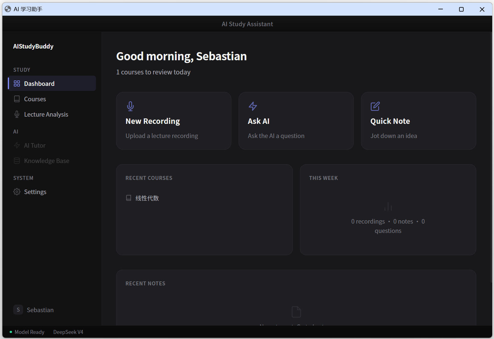
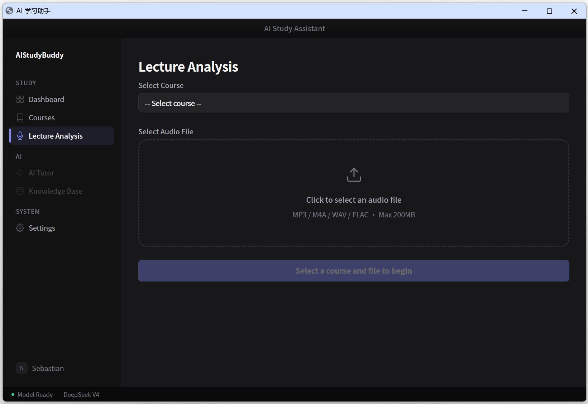
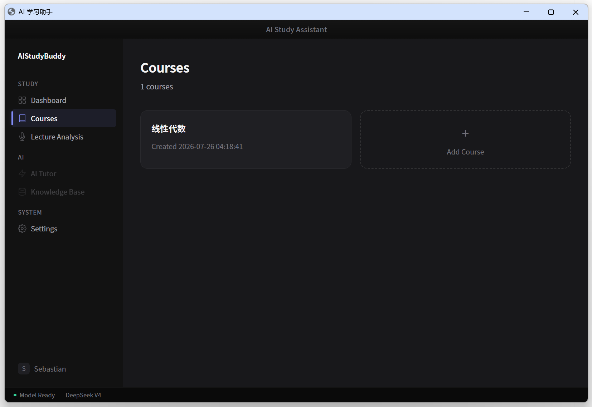
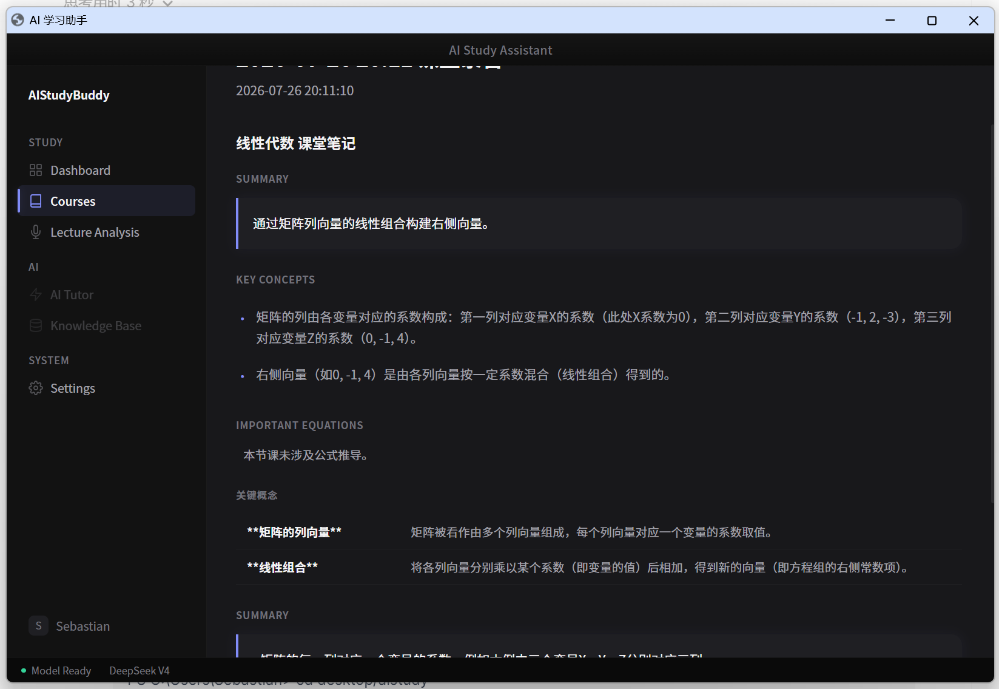

# 🎓 Monad — AI 学习助手

> 面向大学工程学生的桌面 AI 学习工具。上传课堂录音，自动生成结构化学习笔记。


---

## 📸 截图

| Dashboard | 录音分析 |
|:---:|:---:|
|  |  |

| 课程管理 | 课堂笔记 |
|:---:|:---:|
|  |  |

---

## ✨ 核心功能

- 🎤 **录音分析** — 上传课堂录音 → 语音转文字 → AI 生成结构化笔记
- 📚 **课程管理** — 按课程组织课堂记录，随时回看历史笔记
- 📝 **结构化笔记** — Summary / Key Concepts / Equations / Exam Focus / Terminology
- 🤖 **AI 驱动** — DeepSeek API 生成笔记，faster-whisper 本地转录
- 🌍 **中英双语** — UI 支持 English / 简体中文，首次启动自动检测系统语言
- 🌙 **Dark Mode** — 靛紫 + Zinc 灰配色，5 层背景深度
- 📥 **导出** — 复制笔记 / 导出 Markdown 文件

---

## 🧰 技术栈

| 层 | 技术 | 说明 |
|:---|:---|:---|
| UI | HTML5 + CSS3 + JavaScript | 单页应用 (SPA)，无框架 |
| 桌面壳 | [Eel](https://github.com/python-eel/Eel) | Python ↔ 浏览器双向通信 |
| 后端 | Python 3.10+ | 业务逻辑、文件管理、API 编排 |
| 数据库 | SQLite | 课程、课堂记录、设置 |
| 语音识别 | [faster-whisper](https://github.com/SYSTRAN/faster-whisper) | 本地运行，免费 |
| LLM | [DeepSeek API](https://platform.deepseek.com/) | 生成结构化笔记 |
| i18n | 自研 | localStorage + 内联翻译表 |
| 打包 | PyInstaller | 一键出 .exe |


---

## 📁 项目结构

```text
monad/
├── main.py             # 入口，注册所有 eel.expose API
├── config.py           # 全局路径配置
├── db.py               # SQLite 数据库封装
├── utils/
│   └── file_utils.py   # 音频文件验证、复制
├── web/
│   ├── index.html      # SPA Shell + 所有页面模板
│   ├── css/
│   │   └── design-system.css # 设计系统 (CSS 变量)
│   ├── js/
│   │   └── i18n.js     # 翻译引擎 (中/英)
│   └── locales/        # 备用的 JSON 翻译文件
├── data/               # 运行时数据 (自动创建)
│   ├── database.db
│   └── audio/
├── requirements.txt
├── snapshots/          # 应用截图
└── README.md
```


## 🚀 快速开始

### 环境要求

- Python 3.10+
- Windows / macOS / Linux
- [DeepSeek API Key](https://platform.deepseek.com/) — ¥10 够用一整年

### 安装


```bash
git clone https://github.com/你的用户名/monad.git
cd monad
pip install -r requirements.txt
python main.py
```

### 依赖清单

```
eel
faster-whisper
openai
pydub
```

### 使用流程

1. **设置** → 填入 DeepSeek API Key → 保存
2. **课程** → 创建一门课程
3. **录音分析** → 选择课程 → 选择音频 → 开始分析
4. 等待转录 + 笔记生成 → 查看结构化笔记

## 🗺️ 开发路线

| 版本 | 内容 | 状态 |
|:---|:---|:--:|
| V1.0 | 核心闭环：录音 → 转录 → 笔记 | ✅ |
| V1.5 | SPA 架构 / i18n / Dark Mode / 课程管理 / 笔记导出 | ✅ |
| V2.0 | RAG 知识库（上传教材 PDF/PPT，增强笔记准确度） | 🚧 |
| V2.5 | AI Tutor 对话 / 实时录音 / Light Mode | 📋 |
| V3.0 | 复习模式（练习题 / 概念卡片 / 公式手册） | 📋 |


🤝 贡献
欢迎提 Issue 或 PR！

项目由机械工程本科生独立开发，主要依赖 LLM 辅助编程 (Claude / DeepSeek)。

📄 许可证
MIT License — 自由使用、修改、分发。

Made with ❤️ by Sebastian | 机械工程 × AI